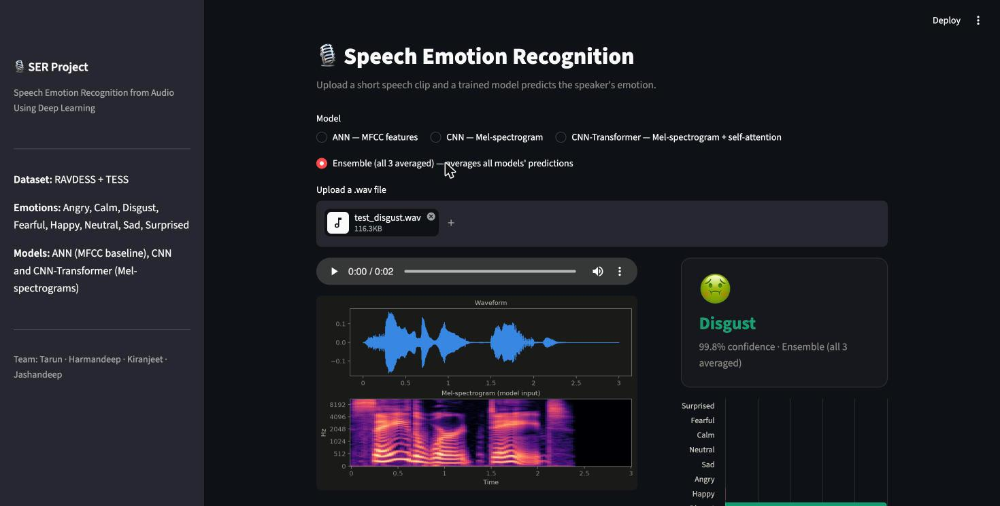

# 🎙️ Speech Emotion Recognition

Predict a speaker's emotion — **angry, calm, disgust, fearful, happy, neutral, sad, surprised** — from a short clip of speech, using only the audio signal. No transcript, no text, just sound.

Three different neural networks were built and compared on the same data, then combined into a simple ensemble that outperforms all three individually.



## Results

| Model | Input | Test Accuracy |
|---|---|---|
| ANN (baseline) | MFCC feature vector | 88.7% |
| CNN | Mel-spectrogram | 88.6% |
| CNN-Transformer | Mel-spectrogram + self-attention | 87.3% |
| **Ensemble (all 3 averaged)** | — | **92.3%** |

All four are evaluated on the same held-out test set of 848 clips (20% split, stratified by emotion, never touched during training). The three individual models land within 1.4 points of each other; averaging their predictions — no extra training required — recovers a further ~3.6-point jump because the three models make different mistakes on the same clips.

**A full plain-language walkthrough** of the dataset, the exact audio → numbers conversion, each model's architecture, and the results is in [`PROJECT_WALKTHROUGH.md`](PROJECT_WALKTHROUGH.md).

## What's in this repo

```
data/raw/RAVDESS/       # actor folders of .wav files (download separately, see below)
data/raw/TESS/          # TESS folders of .wav files (download separately, see below)
data/processed/         # manifest.csv (tracked) + cached feature arrays (regenerated, not tracked)
src/
  data_utils.py          # scans data/raw, builds manifest.csv (filepath -> emotion label)
  features.py             # MFCC + Mel-spectrogram extraction (Librosa)
  build_dataset.py       # extracts features for every clip, caches as X_mfcc.npy / X_mel.npy / y.npy
  augment.py               # noise + pitch-shift augmentation (training set only)
  eda.py                    # class-balance and waveform/spectrogram example plots
  models.py                # ANN, CNN, and CNN-Transformer architectures (Keras)
  train.py                  # trains and evaluates all three models, saves to models/
app.py                    # Streamlit GUI — upload a clip, pick a model, get a live prediction
models/                  # trained .keras models
reports/                 # EDA plots + GUI screenshot
PROJECT_WALKTHROUGH.md  # full plain-language project writeup
SER_Project_Report.docx # written project report
```

## How it works, in short

1. Every clip is resampled to 22,050 Hz and padded/trimmed to exactly 3 seconds.
2. It's converted into either a **40-number MFCC vector** (a compact "tone summary," used by the ANN) or a **128×130 Mel-spectrogram** (a picture-like grid of pitch over time, used by the CNN and CNN-Transformer).
3. Each model is trained independently — dense layers for the ANN, convolutional filters for the CNN, and convolution + self-attention for the CNN-Transformer — with early stopping and, for the two spectrogram models, noise/pitch-shift augmentation on the training set only.
4. The Ensemble just averages all three models' predicted probabilities at inference time.

See [`PROJECT_WALKTHROUGH.md`](PROJECT_WALKTHROUGH.md) for the full step-by-step explanation of each part.

## Setup

TensorFlow requires Python ≤3.11.

```bash
python3.11 -m venv .venv
source .venv/bin/activate
pip install -r requirements.txt
```

## Get the data

1. RAVDESS: https://www.kaggle.com/datasets/uwrfkaggler/ravdess-emotional-speech-audio
2. TESS: https://www.kaggle.com/datasets/ejlok1/toronto-emotional-speech-set-tess

Download and unzip into `data/raw/RAVDESS/` and `data/raw/TESS/` respectively (or use the `kaggle` CLI, already in `requirements.txt`, once you've set up your `~/.kaggle/kaggle.json` API token). The raw dataset (~840MB) isn't tracked in this repo.

## Run the pipeline

Run all commands from the project root — the manifest and cached feature files use paths relative to the project root.

```bash
python src/data_utils.py       # builds data/processed/manifest.csv
python src/build_dataset.py    # extracts MFCC + Mel-spectrogram features (~1 min for 4,240 files)
python src/eda.py              # class balance + waveform/spectrogram plots -> reports/
python src/train.py            # trains ANN, CNN, CNN-Transformer (with train-only augmentation)
```

Training runs entirely on CPU — no GPU required for a dataset this size. The CNN-Transformer took the longest to converge (~35 epochs vs. fewer for the ANN and CNN), since its self-attention layers have more to learn.

## Run the demo app

```bash
streamlit run app.py
```

Opens at `http://localhost:8501`. Upload a `.wav` clip, pick a model (or the Ensemble), and see the predicted emotion, confidence, waveform, spectrogram, and a side-by-side comparison across all models.

## Team

| Member | Responsibilities |
|---|---|
| Tarun Karnati | Project coordination, literature review, CNN model implementation |
| Harmandeep Kaur | Audio preprocessing, MFCC & Mel-spectrogram generation, EDA |
| Kiranjeet Kaur Deol | ANN baseline and CNN-Transformer model building and training |
| Jashandeep Kaur | Model evaluation, confusion matrices, visualizations, final report |

## References

- Vaswani, A. et al. (2017). Attention is all you need. *NeurIPS 2017*.
- Singh, J., Saheer, L. B., & Faust, O. (2023). Speech emotion recognition using attention model. *International Journal of Environmental Research and Public Health, 20*(6), 5140.
- Livingstone, S. R., & Russo, F. A. (2018). The Ryerson Audio-Visual Database of Emotional Speech and Song (RAVDESS). *PLOS ONE, 13*(5), e0196391.
- Toronto Emotional Speech Set (TESS). (2020). University of Toronto.
